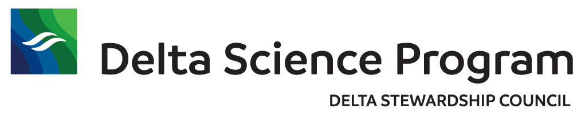

In collaboration with the Delta Science Program we are running a 12 month facilitated research synthesis activity, supported by 3 one-week intensive training events. Curriculum material will focus on introducing Delta Researchers to best practices in, and application of, scientific computing and
scientific software for reproducible science. In addition to developing and delivering learning curriculum, this collaboration will include the provision of data consulting, synthesis facilitation, and a remote workshop to conclude the group synthesis activities.

The learning curricula will focus on techniques for data management, scientific programming, synthetic analysis, and collaboration techniques through the use of open-source, community-supported tools. Participants will learn skills for rapid and robust use of open source scientific software. These approaches will be explored and applied to scientific synthesis projects related to the Delta ecosystem.

The course will weave together several core themes which are reinforced -- and injected into the real-time synthetic scientific research process -- through work on group synthesis projects.

## Schedule

Week 1: September 13-17, 2021. Remote.  
Week 2: October 25-29, 2021. UC Davis.  
Week 3: November 1-5, 2021. UC Davis.  

## Materials

[Materials Week 1](https://learning.nceas.ucsb.edu/2021-09-delta/)
[Materials Week 2](https://learning.nceas.ucsb.edu/2021-10-delta/)
[Materials Week 3](https://learning.nceas.ucsb.edu/2021-11-delta/)

## Instructors

#### Jeanette Clark

Jeanette is a Projects Data Coordinator at NCEAS with extensive experience helping synthesis scientists find, synthesize, document, and publish datasets. She also helps maintain the Knowledge Network for Biocomplexity (KNB) data archive. She has expertise in R, GitHub, structured metadata, and data archival. Jeanette was introduced to data processing and data analysis through her academic background in physical oceanography, and enjoys applying this foundation to more interdisciplinary ecology research.

#### Amber Budden

Amber is the Director of Learning and Outreach at NCEAS and lead of community engagement and outreach at DataONE and the Arctic Data Center. She holds a PhD in Ecology in addition to research experience in bibliometrics. She has coordinated and taught numerous workshops focused on data management for Earth and environmental science. Her skills include data management, science communication and outreach, and training evaluation.

#### Matt Jones

Matt is the Director of Informatics Research and Development at NCEAS and has expertise in environmental informatics, particularly software for management, integration, analysis, and modeling of data. Jones has taught at over 20 training workshops over a decade on data science topics including analysis in R, GitHub, programming (e.g., Python), data management, quality assessment and reporting, metadata and data infrastructure, scientific workflow systems, and other topics.

#### Chris Lortie

Chris Lortie is Professor of Ecology at York University. He received his B.Sc. in Biology, Bachelor’s of Education, and Master’s degrees from Queen’s University and was awarded a PhD in Botany from the University of British Columbia. Chris' areas of research include community ecology, seedbanks, invasive species, social ecology and theory development with a focus on synthesis and meta-analytical techniques.

#### David DeLeBauer

Dr. David LeBauer Director of Data Science for the Division of Agriculture, Life and Veterinary Sciences and Cooperative Extension, University of Arizona. David develops open data and software that enables synthesis of observations with systems-level understanding to improve understanding and prediction of agricultural yield potential as well as ecosystem carbon, nutrient, water, and energy budgets.

#### Jessica Guo

Jessica Guo is a scientific programmer and plant ecophysiologist in the Digital Agriculture Group at the University of Arizona. Her background is in hierarchical Bayesian modeling of plant and ecosystem processes. She completed her PhD in Biology at Northern Arizona University with Dr. Kiona Ogle.

## Participants

-    Shruti Khanna
-    Christina Burdi
-    Catarina Pien
-    Peter Dudley
-    Denise Colombano
-    Mattea Berglund
-    Parsa Saffarinia
-    Suzanne Manugian
-    Lara Mitchell
-    Lauren Yamane
-    Elizabeth Stumpner
-    Tanya Rogers
-    Ryan Peek
-    Chuck Hansen
-    Sam Bashevkin
-    Dylan Chapple
-    Pascale Goertler
-    Sarah Perry
-    Brian Mahardja
